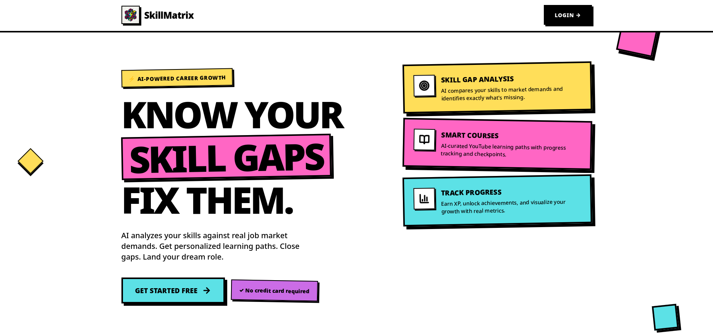
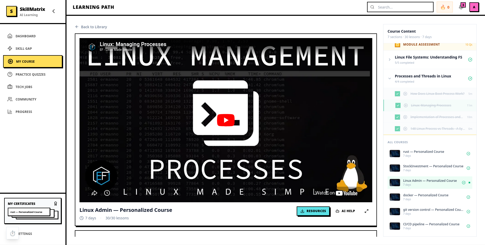
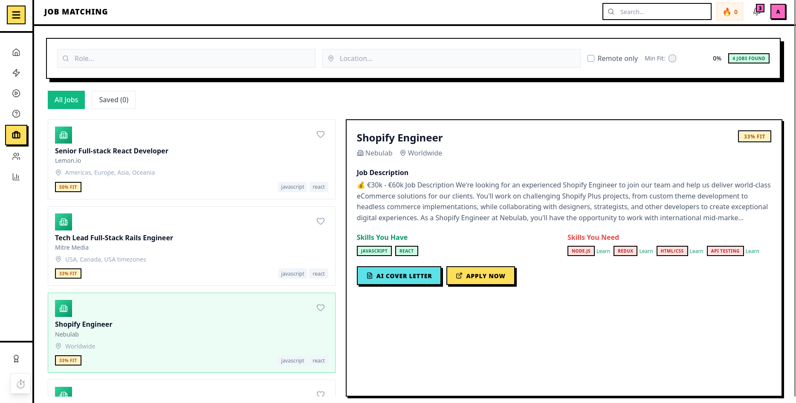
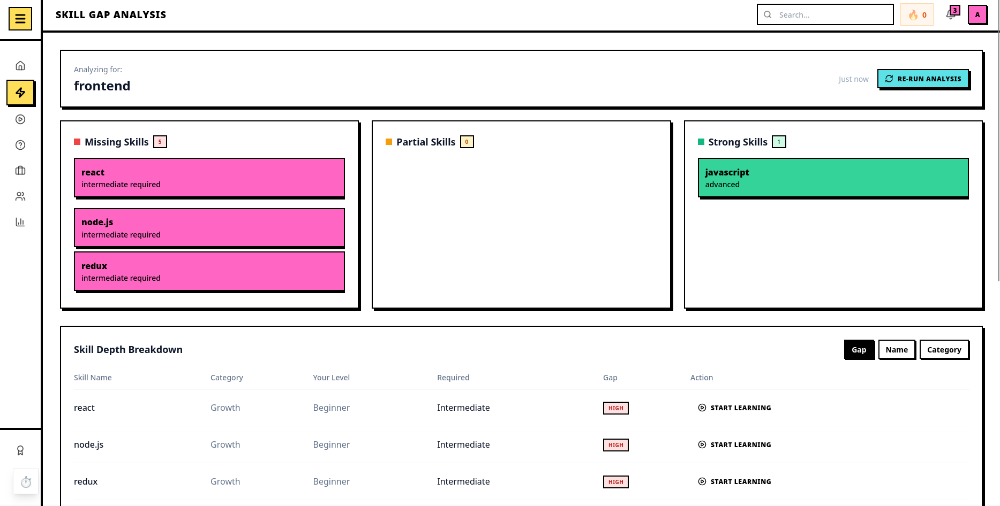
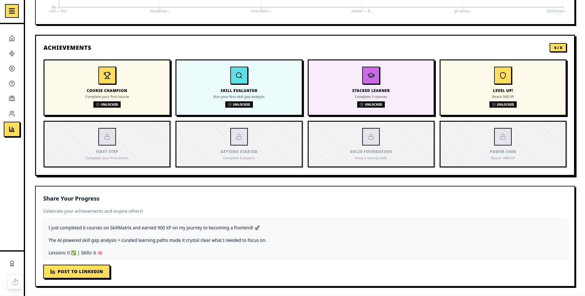
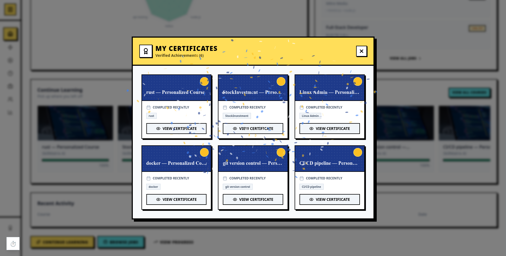
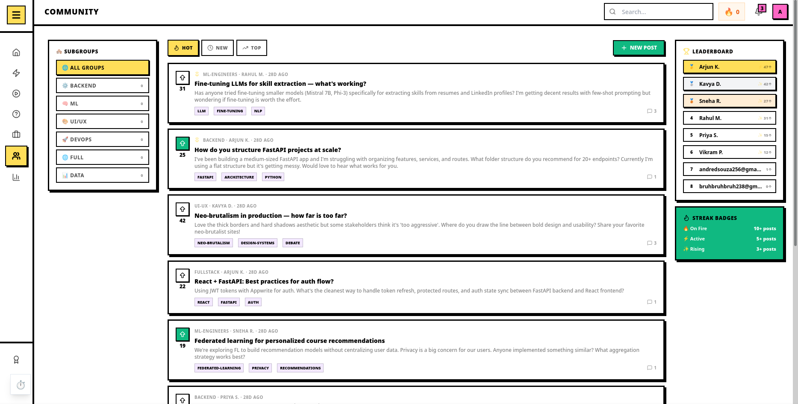

# SkillMatrix



AI-powered career guidance platform. Analyzes your skills against real job market demands, identifies gaps, and generates personalized learning paths.

## Tech Stack

| Layer | Tech |
|-------|------|
| **Frontend** | React 19, Vite, TypeScript, Tailwind CSS (Neo-Brutalism) |
| **Backend** | Python, FastAPI, Appwrite (Auth + DB) |
| **AI/LLM** | Ollama (Mixtral) — course generation, skill analysis |
| **FL Engine** | scikit-learn — federated assessment of student comprehension |

## Quick Start

### Frontend

```bash
cd frontend/app
npm install
npm run dev
# → http://localhost:5173
```

### Backend

```bash
cd backend
uv sync
cp .env.example .env   # configure Appwrite + Ollama
uv run uvicorn main:app --reload --port 8000
```

## Project Structure

```
SkillMatrix/
├── frontend/app/          # React + Vite SPA
│   ├── src/
│   │   ├── features/      # Feature-based modules
│   │   │   ├── home/      # Landing page (neo-brutalism)
│   │   │   ├── auth/      # Login / Signup
│   │   │   ├── onboarding/# Role selection wizard
│   │   │   ├── dashboard/ # Main dashboard
│   │   │   ├── skillgap/  # Skill gap analysis
│   │   │   ├── learning/  # Course viewer
│   │   │   ├── jobs/      # Job recommendations
│   │   │   ├── progress/  # XP & achievements
│   │   │   └── settings/  # User settings
│   │   ├── components/    # Shared UI (MatrixCard, MatrixButton, etc.)
│   │   └── stores/        # Zustand state management
│   └── tailwind.config.js
│
├── backend/               # FastAPI server
│   ├── app/
│   │   ├── features/
│   │   │   ├── auth/       # Appwrite auth
│   │   │   ├── curriculum/ # AI course generation
│   │   │   ├── profile/    # User profiles & skills
│   │   │   └── fl_engine/  # Federated Learning engine
│   │   └── config.py
│   └── main.py
│
└── .gitignore
```

## Features

- **Skill Gap Analysis** — AI compares your skills to real job market demands
- **Smart Courses** — LLM-generated learning paths with YouTube content
- **FL Assessment** — Federated learning model evaluates test answers (weak/partial/strong)
- **Adaptive Curriculum** — FL results tell the LLM to expand or shorten modules
- **Progress Tracking** — XP system, streaks, and achievement badges







